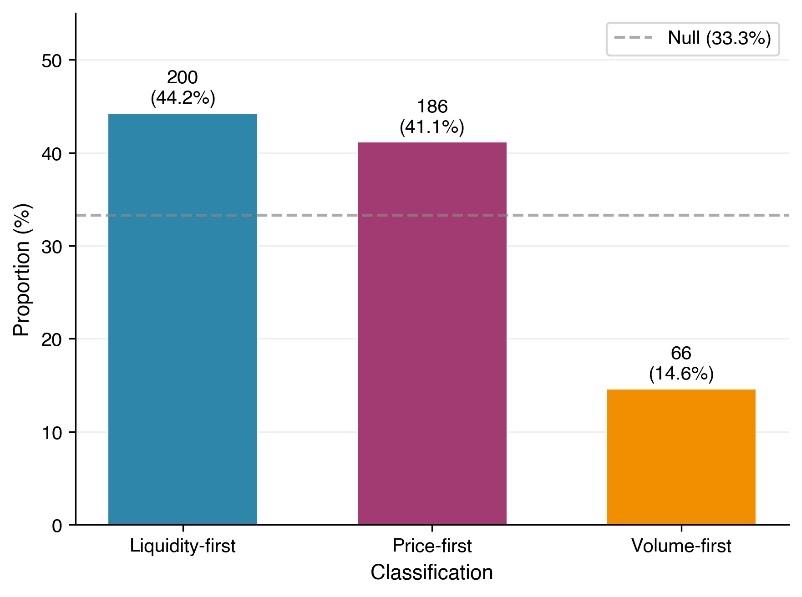
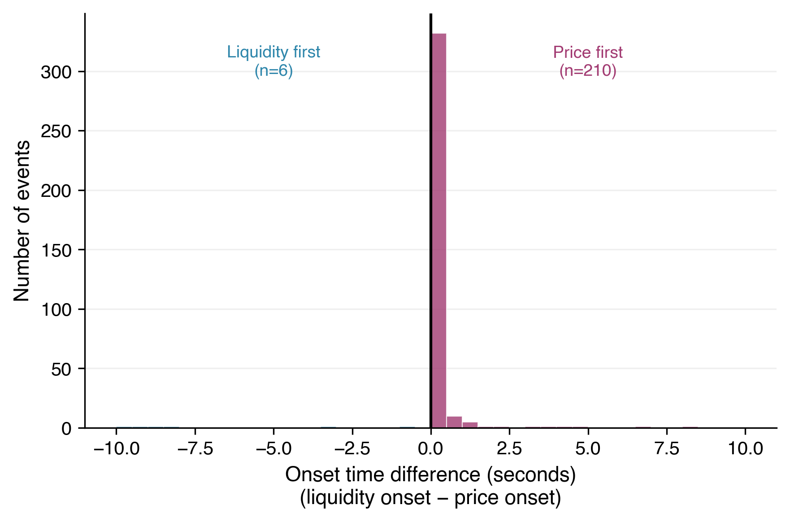
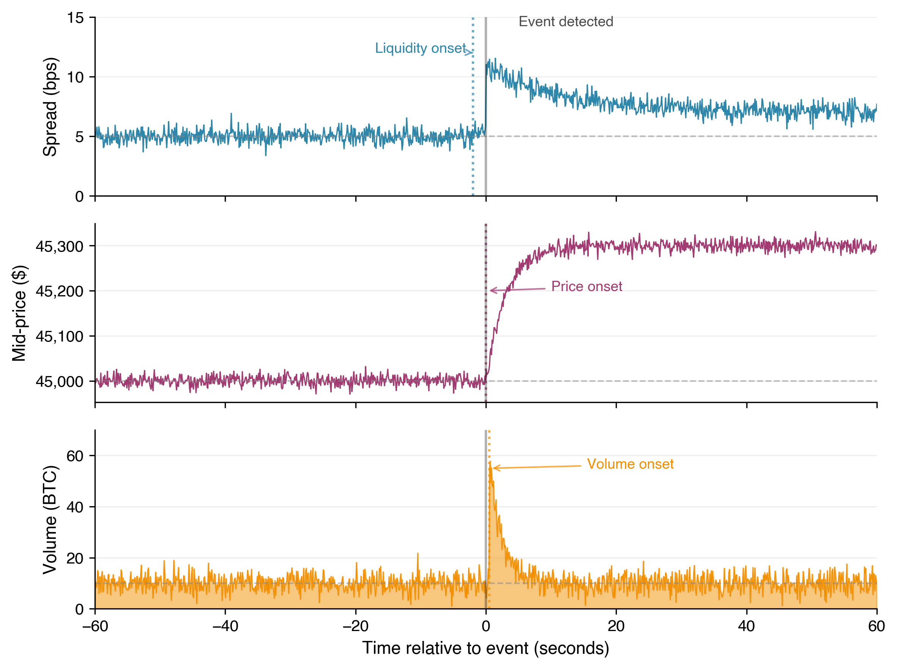

# Liquidity Withdrawal Precedes Price Shocks: Evidence from Cryptocurrency Futures

**Authors:** [Author names to be added]

**Date:** February 2026

---

## Abstract

<!-- Target: 200-250 words -->

Understanding how price shocks originate in financial markets has implications for market design, risk management, and trading strategies. We study whether observable market signals change before rapid price movements occur, focusing on the temporal ordering of liquidity, price, and volume changes around price shock events.

We analyze 452 price shock events across BTCUSDT and ETHUSDT perpetual futures on Binance over 17 trading days. For each event, we detect when liquidity (bid-ask spread), price, and volume first deviate from baseline behavior, then classify events by which signal changed first.

We find that liquidity withdrawal precedes price shocks at a rate significantly above chance. Of 452 events, 200 (44.25%) show liquidity changes first, compared to 186 (41.15%) price-first and 66 (14.60%) volume-first events. A binomial test against a uniform null hypothesis of 33.3% yields p = 2 × 10⁻⁶, and a bootstrap 95% confidence interval of [39.6%, 48.7%] excludes the null proportion.

This finding is consistent with theories of informed trading where market makers or informed participants withdraw liquidity before price-moving events. However, we emphasize that our analysis establishes correlation, not causation. The observed ordering may reflect detection artifacts, latency differences between data feeds, or threshold sensitivities. We discuss these limitations and suggest directions for more robust causal identification.

---

## 1. Introduction

<!-- Target: 400-500 words -->

Rapid price movements in financial markets can have significant consequences. Flash crashes erode market confidence, trigger margin calls, and cause substantial losses for participants caught on the wrong side. Understanding how these events begin—whether they are preceded by detectable warning signals—matters for market design, risk management, and our understanding of price formation.

A central question in market microstructure is whether liquidity conditions change before prices move, or whether price changes drive liquidity responses. If informed traders or market makers systematically withdraw liquidity before price shocks, this signal could in principle be observed and acted upon. Conversely, if prices simply gap without warning and liquidity follows, early detection becomes more difficult.

In this paper, we study the temporal ordering of liquidity, price, and volume changes around price shock events in cryptocurrency futures markets. We ask a specific empirical question: **When a large price movement occurs, does liquidity (measured by bid-ask spread) typically change first, or does price move first?**

We analyze 452 price shock events across BTCUSDT and ETHUSDT perpetual futures on Binance, covering 17 trading days selected for their volatility. For each event, we detect when liquidity, price, and volume first deviate significantly from their baseline behavior using a standardized threshold approach. We then classify each event by which signal changed first.

Our main finding is that liquidity withdrawal precedes price shocks at a rate significantly above what we would expect by chance. Of the 452 events we analyze, 200 (44.25%) show liquidity changing first, compared to 186 (41.15%) price-first and 66 (14.60%) volume-first events. A binomial test against a null hypothesis of 33.3% (uniform across three categories) yields p = 2 × 10⁻⁶, and the bootstrap 95% confidence interval [39.6%, 48.7%] excludes the null proportion.

This paper makes three contributions:

1. **An empirical finding.** We document that liquidity withdrawal precedes price shocks at statistically significant rates in cryptocurrency perpetual futures. This pattern is consistent across both assets in our sample and robust to threshold sensitivity analysis.

2. **A methodology for temporal ordering analysis.** We develop a simple, reproducible approach for detecting signal onset times and classifying events by ordering. The method is transparent and can be applied to other markets and asset classes.

3. **A curated dataset.** We construct a dataset of labeled price shock events with precise onset timestamps, enabling future research on event dynamics.

We emphasize that our analysis establishes correlation, not causation. The observed ordering could reflect threshold artifacts, latency differences, or other confounds. We discuss these limitations in detail and suggest what additional evidence would strengthen or weaken our interpretation.

The remainder of this paper is organized as follows. Section 2 reviews related work. Section 3 describes our data. Section 4 details our methodology. Section 5 presents results. Section 6 discusses interpretation and alternative explanations. Section 7 addresses limitations. Section 8 concludes.

---

## 2. Related Work

<!-- Target: 300-400 words -->
<!-- TODO: MF-V3-009 -->

[Related work placeholder - to be written]

---

## 3. Data

<!-- Target: 300-400 words -->

### 3.1 Data Source

We analyze data from Binance USD-M perpetual futures, the largest cryptocurrency derivatives venue by trading volume. We obtain historical data from data.binance.vision, Binance's public data repository, which provides complete order book and trade data for research purposes.

For each trading day, we download two data feeds:

- **aggTrades**: Aggregated trade records containing timestamp, price, quantity, and trade direction for every executed trade.
- **bookTicker**: Best bid and ask prices with their quantities, updated on every change to the top of the order book.

We convert raw exchange data into a canonical format with two files per day: `trades.csv` containing trade executions, and `tob.csv` containing top-of-book snapshots. Both files use ISO 8601 timestamps with microsecond precision. This preprocessing enables consistent analysis across dates and simplifies event detection.

### 3.2 Date Selection

We analyze two assets: BTCUSDT (Bitcoin perpetual) and ETHUSDT (Ethereum perpetual), selected for their high liquidity and trading activity. We selected 17 trading days between January and March 2024, chosen to capture periods of elevated volatility when price shocks are more frequent. The selection includes days surrounding major market events such as Bitcoin ETF approvals (early January 2024) and subsequent price rallies.

We intentionally avoid random date sampling. Our goal is to analyze price shock events, which are rare on typical trading days. Selecting volatile days increases the number of events available for analysis. This approach biases our sample toward "interesting" market conditions, which we discuss in Section 7 (Limitations).

### 3.3 Summary Statistics

**Table 1: Data Summary**

| Metric | Value |
|--------|-------|
| Assets | BTCUSDT, ETHUSDT |
| Trading days | 17 |
| Date range | January 3 – March 29, 2024 |
| Total events detected | 452 |
| Events (BTCUSDT) | 239 |
| Events (ETHUSDT) | 213 |
| Data source | Binance USD-M Futures |
| Raw data feeds | aggTrades, bookTicker |
| Canonical format | trades.csv, tob.csv |

Event counts vary substantially across dates, ranging from 1 event (March 29) to 83 events (March 5). The most active dates correspond to periods of high market volatility. BTCUSDT and ETHUSDT contribute similar numbers of events (239 and 213 respectively), allowing us to compare patterns across assets.

---

## 4. Methods

<!-- Target: 600-800 words -->

Our methodology consists of four stages: (1) detecting price shock events, (2) extracting analysis windows around each event, (3) detecting onset times for liquidity, price, and volume signals, and (4) classifying events by which signal changed first. We then apply statistical tests to determine whether the observed ordering distribution differs from chance.

### 4.1 Event Detection

We define a **price shock** as a price movement exceeding a threshold percentage within a rolling time window. Formally, for a time series of mid-prices *p(t)*, we flag an event at time *t* if:

$$\left| \frac{p(t) - p(t - \Delta)}{p(t - \Delta)} \right| \geq \theta$$

where Δ is the rolling window duration (60 seconds) and θ is the threshold (0.5% in our primary analysis). We detect events using mid-prices computed from top-of-book data as *(bid + ask) / 2*.

To avoid counting the same market move multiple times, we apply a de-duplication rule: if multiple threshold crossings occur within the same rolling window, we keep only the event with the largest magnitude. This ensures that a single large price move generates exactly one event, regardless of how many intermediate threshold crossings occur.

### 4.2 Window Extraction

For each detected event, we extract symmetric windows of market data centered on the event timestamp. The **pre-event window** contains the 300 seconds before the event (not including the event timestamp). The **post-event window** contains the 300 seconds starting from the event timestamp.

When events occur close together in time, their windows may overlap. We handle this by keeping only the first event in each non-overlapping sequence. Specifically, if a second event's timestamp falls within the first event's post-window, we exclude the second event. This ensures each analysis window represents an independent observation.

For each window, we extract:
- **Top-of-book data**: Bid price, ask price, and their quantities at each book update
- **Trade data**: Individual trade executions with price, size, and direction

### 4.3 Onset Detection

For each signal (liquidity, price, volume), we detect the **onset time**—the first moment in the post-event window when that signal deviates significantly from its pre-event baseline. We use a threshold-based approach calibrated to each signal's variance.

**Baseline computation.** For each signal, we compute the mean (μ) and standard deviation (σ) from the pre-event window. For liquidity, we use bid-ask spread values. For price, we use mid-prices. For volume, we aggregate trade sizes into 5-second buckets and compute statistics over bucket volumes.

**Threshold crossing.** We flag an onset when the signal first exceeds μ + *k*σ in the post-event window, where *k* = 2.0 (configurable). The specific conditions are:

- **Liquidity onset**: Spread exceeds baseline + 2σ (spread widening indicates liquidity withdrawal)
- **Price onset**: Mid-price moves beyond baseline ± 2σ (direction depends on whether the event was an up or down shock)
- **Volume onset**: 5-second bucket volume exceeds baseline + 2σ

If a signal never crosses its threshold in the post-window, we record no onset for that signal. If the baseline standard deviation is near zero (insufficient variation), we use a small fraction of the baseline value as a minimum threshold to avoid degeneracy.

### 4.4 Classification Scheme

We classify each event based on which signal's onset occurs first:

- **Liquidity-first**: Spread onset precedes both price and volume onsets
- **Price-first**: Price onset precedes both spread and volume onsets
- **Volume-first**: Volume onset precedes both spread and price onsets
- **Undetermined**: Fewer than two signals crossed their thresholds

Events classified as "undetermined" are excluded from statistical analysis, as they provide no information about relative ordering.

### 4.5 Statistical Tests

We test whether the observed proportion of liquidity-first events differs from chance. Under a null hypothesis of no systematic ordering, we expect each of the three categories to occur with equal probability (33.3%).

**Binomial test.** We treat the liquidity-first count as a binomial random variable with *n* = 452 trials and null success probability *p*₀ = 1/3. We compute the two-sided p-value for the observed proportion (44.25%).

**Bootstrap confidence interval.** We construct a 95% confidence interval for the true liquidity-first proportion using the percentile bootstrap method with 1,000 resamples and a fixed random seed for reproducibility. If this interval excludes the null proportion (33.3%), we consider the result robust.

Figure 3 illustrates the methodology on an example event, showing the temporal progression of spread, price, and volume signals around a detected price shock.

---

## 5. Results

<!-- Target: 500-700 words -->
<!-- TODO: MF-V3-006 -->

[Results section placeholder - to be written]

### 5.1 Main Finding

### 5.2 Statistical Significance

### 5.3 Asset Comparison

### 5.4 Threshold Sensitivity

**Figure 1: Ordering Proportions**

*Figure 1: Distribution of ordering classifications across 452 detected price shock events. Liquidity-first events (44.25%) significantly exceed the null expectation of 33.3% under uniform distribution (p < 0.001).*

**Figure 2: Onset Delta Distribution**

*Figure 2: Histogram of onset time differences (liquidity onset minus price onset) for events where both signals were detected. Negative values indicate liquidity changed before price.*

**Figure 3: Example Event**

*Figure 3: Example event window showing the temporal sequence of spread widening (top), price movement (middle), and volume activity (bottom). Vertical dashed line marks the detected price shock timestamp.*

---

## 6. Discussion

<!-- Target: 400-500 words -->
<!-- TODO: MF-V3-007 -->

[Discussion section placeholder - to be written]

### 6.1 Interpretation

### 6.2 Alternative Explanations

### 6.3 Connection to Market Microstructure Theory

---

## 7. Limitations

<!-- Target: 400-500 words -->
<!-- TODO: MF-V3-008 -->

[Limitations section placeholder - to be written]

---

## 8. Conclusion

<!-- Target: 200-250 words -->
<!-- TODO: MF-V3-010 -->

[Conclusion placeholder - to be written]

---

## References

See [references.md](references.md) for full bibliography.

---

## Appendix

See [appendix.md](appendix.md) for supplementary materials including:
- Complete list of analysis dates
- Additional robustness checks
- Per-asset breakdown tables
